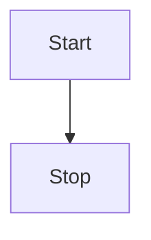
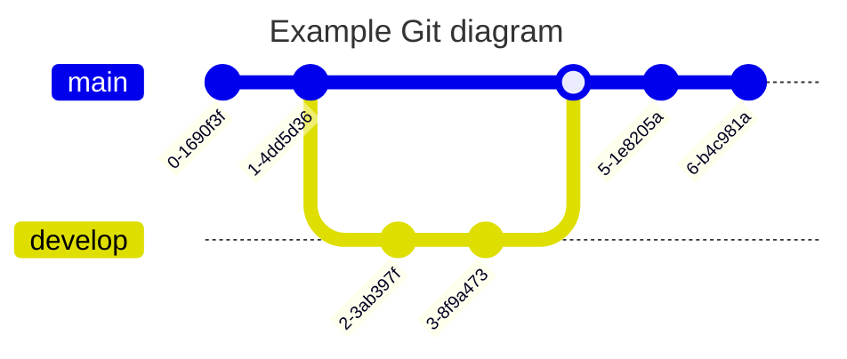

# 一级标题

## 二级标题



### 三级标题

#### 四级标题

##### 五级标题

###### 六级标题

## 标题中的[链接](https://imzbf.github.io/markdown-theme)

## 标题中的`code`

这是一级标题下的段落。

普通的段落，普通的段落。

## 基本演示

段落中文字**加粗**，<u>下划线</u>， _斜体_ ，~删除线~，上标<sup>26</sup>，下标<sub>26</sub>，`inline code`，[超链接](https://imzbf.github.io/markdown-theme)

> 引用：这是一段引用，引用中的文字**加粗**，<u>下划线</u>， _斜体_ ，~删除线~，上标<sup>26</sup>，下标<sub>26</sub>，`inline code`，[超链接](https://imzbf.github.io/markdown-theme)

这是一个普通段落

```javascript [g1:yarn]
import { createApp } from 'vue';
import App from './App.vue';

createApp(App).mount('#app');
```

```css [g1:npm]
margin-bottom: 0;
border-top-left-radius: 5px;
border-top-right-radius: 5px;
background-position: 10px 10px;
```

---

> 多段落引用
>
> 引用中的图片
>
> 
>
> 引用中的列表
>
> 1. 类型
> 2. 默认值
>
> - 类型
> - 默认值
>
> 任务
>
> - [x] 打开冰箱门
> - [ ] 把大象放进去
> - [ ] 关闭冰箱
>
> 引用中的标题
>
> | 昵称 | 性别   | 来自      |
> | ---- | ------ | --------- |
> | 之间 | 外星人 | 中国-重庆 |
> | 之间 | 外星人 | 中国-重庆 |
> | 之间 | 外星人 | 中国-重庆 |
> | 之间 | 外星人 | 中国-重庆 |
>
> | 昵称 | 性别   | 来自      |
> | ---- | ------ | --------- |
> | 之间 | 外星人 | 中国-重庆 |
> | 之间 | 外星人 | 中国-重庆 |
> | 之间 | 外星人 | 中国-重庆 |
> | 之间 | 外星人 | 中国-重庆 |
>
> 引用中的代码
>
> ```js
> const a = 1;
> ```
>
> 引用中的数学公式
>
> 行内 $x+y^{2x}$
>
> 块级
>
> $$
> \sqrt[3]{x}
> $$
>
> 引用中的图表
>
> ```mermaid
> ---
> title: Example Git diagram
> ---
> gitGraph
>    commit
>    commit
>    branch develop
>    checkout develop
>    commit
>    commit
>    checkout main
>    merge develop
>    commit
>    commit
> ```
>
> 引用中的提示
>
> !!! tip 支持的类型
>
> note、abstract、info、tip、success、question、warning
>
> failure、danger、bug、example、quote、hint、caution、error、attention
>
> !!!
>
> !!! info 故乡
>
> 深蓝的天空中挂着一轮金黄的圆月，下面是海边的沙地，都种着一望无际的碧绿的西瓜。其间有一个十一二岁的少年，项带银圈，手捏一柄钢叉，向一匹猹尽力的刺去。那猹却将身一扭，反从他的胯下逃走了。
>
> 这少年便是闰土。我认识他时，也不过十多岁，离现在将有三十年了；那时我的父亲还在世，家景也好，我正是一个少爷。那一年，我家是一件大祭祀的值年。这祭祀，说是三十多年才能轮到一回，所以很郑重。正（zhēng）月里供像，供品很多，祭器很讲究，拜的人也很多，祭器也很要防偷去。我家只有一个忙月（我们这里给人做工的分三种：整年给一定人家做工的叫长工；按日给人做工的叫短工；自己也种地，只在过年过节以及收租时候来给一定的人家做工的称忙月），忙不过来，他便对父亲说，可以叫他的儿子闰土来管祭器的。
>
> !!!
>
> 我是普通的引用文字

## 图片


## 一行多图

图片都是行内元素显示：

    

## 块级代码

```js
const a = '1';
```

```js
async onUploadImg(files: FileList, callback: (urls: string[]) => void) {
  const res = await Promise.all(
    Array.from(files).map((file) => {
      return new Promise((rev, rej) => {
        const form = new FormData();
        form.append('file', file);

        axios
          .post('/api/img/upload', form, {
            headers: {
              'Content-Type': 'multipart/form-data'
            }
          })
          .then((res) => rev(res))
          .catch((error) => rej(error));
      });
    })
  );

  callback(res.map((item: any) => item.data.url));
}
```

- [x] Write the press release
- [ ] Update the website
- [ ] Contact the media
- 哈哈哈

## 全局配置

`Vue.config` 是一个对象，包含 Vue 的全局配置。可以在启动应用之前修改下列 property：

### 说明

- 类型：`boolean`
- 默认值：`false`

  用法：

  ```js
  Vue.config.silent = true;
  ```

取消 Vue 所有的日志与警告。

### optionMergeStrategies

- 类型：`{ [key: string]: Function }`
- 默认值：`{}`

  用法：

  ```js
  Vue.config.optionMergeStrategies._my_option = function (parent, child, vm) {Vue.config.optionMergeStrategies._my_option = function (parent, child, vm) {
    return child + 1;
  };

  const Profile = Vue.extend({
    _my_option: 1,
  });

  // Profile.options._my_option = 2
  ```

  自定义合并策略的选项。

  合并策略选项分别接收在父实例和子实例上定义的该选项的值作为第一个和第二个参数，Vue 实例上下文被作为第三个参数传入。

- 参考 [自定义选项的混入策略](自定义选项的混入策略)

<hr>

## md-editor-v3

Markdown 编辑器，基于 vue3，使用 jsx 和 typescript 语法开发，支持切换主题、prettier 美化文本等。

## 代码演示

```js
import { defineComponent, ref } from 'vue';
import MdEditor from 'md-editor-v3';
import 'md-editor-v3/lib/style.css';

export default defineComponent({
  name: 'MdEditor',
  setup() {
    const text = ref('');
    return () => (
      <MdEditor
        modelValue={text.value}
        onChange={(v: string) => (text.value = v)}
      />
    );
  },
});
```

```js
import { defineComponent, ref } from 'vue';
import MdEditor from 'md-editor-v3';
import 'md-editor-v3/lib/style.css';

export default defineComponent({
  name: 'MdEditor',
  setup() {
    const text = ref('');
    return () => (
      <MdEditor
        modelValue={text.value}
        onChange={(v: string) => (text.value = v)}
      />
    );
  },
});
```

## 文本演示

依照普朗克长度这项单位，目前可观测的宇宙的直径估计值（直径约 930 亿光年，即 8.8 × 10<sup>26</sup> 米）即为 5.4 × 10<sup>61</sup>倍普朗克长度。而可观测宇宙体积则为 8.4 × 10<sup>184</sup>立方普朗克长度（普朗克体积）。

哈哈哈

---

<https://markdown.com.cn>

---

[](https://markdown.com.cn) [](https://markdown.com.cn) [](https://markdown.com.cn)

---

## 表格演示

| 昵称 | 性别   | 来自      |
| ---- | ------ | --------- |
| 之间 | 外星人 | 中国-重庆 |
| 之间 | 外星人 | 中国-重庆 |
| 之间 | 外星人 | 中国-重庆 |
| 之间 | 外星人 | 中国-重庆 |
| 之间 | 外星人 | 中国-重庆 |

| 昵称 | 性别   | 来自      |
| ---- | ------ | --------- |
| 之间 | 外星人 | 中国-重庆 |
| 之间 | 外星人 | 中国-重庆 |
| 之间 | 外星人 | 中国-重庆 |
| 之间 | 外星人 | 中国-重庆 |
| 之间 | 外星人 | 中国-重庆 |

| 昵称 | 性别   | 来自      |
| ---- | ------ | --------- |
| 之间 | 外星人 | 中国-重庆 |
| 之间 | 外星人 | 中国-重庆 |
| 之间 | 外星人 | 中国-重庆 |
| 之间 | 外星人 | 中国-重庆 |
| 之间 | 外星人 | 中国-重庆 |

---

## 🐷 数学公式

有两种模式

### 🐽 行内

$x+y^{2x}$

### 🐸 块级

$$
\sqrt[3]{x}
$$

---

## 🐵 图表



## 🙈 提示

!!! note 支持的类型

note, abstract, info, tip, success, question, warning, failure, danger, bug, example, quote, hint, caution, error, attention

!!!

!!! abstract 支持的类型

note, abstract, info, tip, success, question, warning, failure, danger, bug, example, quote, hint, caution, error, attention

!!!

!!! info 支持的类型

note, abstract, info, tip, success, question, warning, failure, danger, bug, example, quote, hint, caution, error, attention

!!!

!!! tip 支持的类型

note, abstract, info, tip, success, question, warning, failure, danger, bug, example, quote, hint, caution, error, attention

!!!

!!! success 支持的类型

note, abstract, info, tip, success, question, warning, failure, danger, bug, example, quote, hint, caution, error, attention

!!!

!!! question 支持的类型

note, abstract, info, tip, success, question, warning, failure, danger, bug, example, quote, hint, caution, error, attention

!!!

!!! warning 支持的类型

note, abstract, info, tip, success, question, warning, failure, danger, bug, example, quote, hint, caution, error, attention

!!!

!!! failure 支持的类型

note, abstract, info, tip, success, question, warning, failure, danger, bug, example, quote, hint, caution, error, attention

!!!

!!! danger 支持的类型

note, abstract, info, tip, success, question, warning, failure, danger, bug, example, quote, hint, caution, error, attention

!!!

!!! bug 支持的类型

note, abstract, info, tip, success, question, warning, failure, danger, bug, example, quote, hint, caution, error, attention

!!!

!!! example 支持的类型

note, abstract, info, tip, success, question, warning, failure, danger, bug, example, quote, hint, caution, error, attention

!!!

!!! quote 支持的类型

note, abstract, info, tip, success, question, warning, failure, danger, bug, example, quote, hint, caution, error, attention

!!!

!!! hint 支持的类型

note, abstract, info, tip, success, question, warning, failure, danger, bug, example, quote, hint, caution, error, attention

!!!

!!! caution 支持的类型

note, abstract, info, tip, success, question, warning, failure, danger, bug, example, quote, hint, caution, error, attention

!!!

!!! error 支持的类型

note, abstract, info, tip, success, question, warning, failure, danger, bug, example, quote, hint, caution, error, attention

!!!

!!! attention 支持的类型

note, abstract, info, tip, success, question, warning, failure, danger, bug, example, quote, hint, caution, error, attention

!!!
